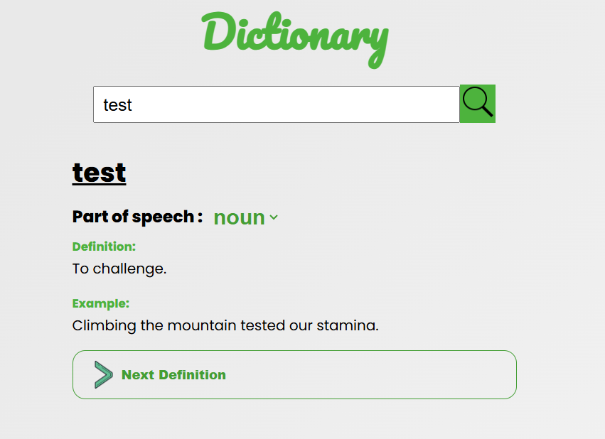

# Dictionary

## Description
This is a Dictionary App that allows users to search for any valid word recognized by the dictionary API. Once a word is searched, the app retrieves and displays all available definitions and example sentences for that word.

## Features
- **Search for words**: Users can search for any valid word and get definitions.
- **Example sentences**: The app displays example sentences for the word to help users understand its context.
- **User-friendly interface**: Clean and simple design for easy word lookup.

## Screenshot
#### Desktop


## Live Demo
- [Dictionary App Live Demo](https://ngobe-thabane.github.io/Roadmap.sh-Projects/DictionaryApp)

## Built With
- **HTML5**: Semantic HTML markup
- **CSS**: Custom properties for styling
- **React**: JavaScript library for building the user interface
- **JavaScript**: Used for app functionality and interacting with the dictionary API

## Installation
If you'd like to run this project locally, you can clone it to your machine and install the necessary dependencies.

1. Clone the repository:
   ```bash
   git clone https://github.com/ngobe-thabane/Dictionary.git
